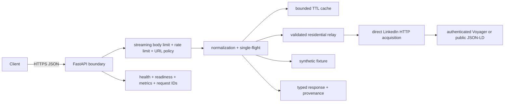

# ProfileProof

[](https://github.com/RitwijParmar/ProfileProof/actions/workflows/ci.yml)

ProfileProof turns a LinkedIn profile URL into stable, typed professional-profile
JSON. Its challenge-compliant path calls LinkedIn's authenticated Voyager
`identity/dash/profiles` surface, walks the normalized entity graph, and reports provenance,
completeness, cache state, limitations, and a request ID. The production acquisition
path does not use a browser, browser automation, official profile APIs, or a third-party
enrichment provider.

## Try it

Open the landing page and enter a real profile, or call the API:

**[Watch the narrated live demo](demo/profileproof-live-demo.mp4)** — deployed UI,
verified real-profile response, raw JSON, pen annotations, validation failure,
natural English narration, and honest operational limitations.

```bash
curl -sS https://profileproof-api-980932890834.us-east1.run.app/v1/profiles/resolve \
  -H 'Content-Type: application/json' \
  -d '{"profile_url":"https://www.linkedin.com/in/seanthorne"}'
```

Check `/v1/capabilities` first: `linkedin_direct.configured: true` confirms that
direct acquisition is available. Interactive documentation is at `/docs`, ReDoc
at `/redoc`, and the machine-readable contract at `/openapi.json`.

## API

### `POST /v1/profiles/resolve`

```json
{
  "profile_url": "https://www.linkedin.com/in/seanthorne"
}
```

| Provider | Purpose | Upstream behavior |
|---|---|---|
| `linkedin_direct` (default) | Retrieve real LinkedIn profile data | Authenticated Voyager full-profile endpoint when session secrets are available; direct public structured-profile fallback otherwise |
| `demo` | Deterministic integration fixture | No upstream call; synthetic and visibly labeled |

The schema covers name, headline, location, about, experience, education, skills,
certifications, languages, and images. Missing data is absent or an empty list; it
is never invented. Responses include explicit acquisition mode, limitations,
warnings, and cache state.

Errors use `application/problem+json` with `type`, `title`, `status`, `detail`,
`instance`, and `request_id`.

## Architecture



Identical concurrent cache misses share one upstream operation, preventing a
request burst from multiplying LinkedIn calls. Uncached upstream starts are
serialized and paced per instance. A LinkedIn `429` or non-standard `999` opens
a bounded cooldown circuit, exposes `Retry-After`, and prevents retries from
amplifying an upstream throttle. Acquisition is isolated behind
a provider interface, so the response contract is independent of the data source.
The deployed service discovers the current residential worker through a public,
non-secret Cloud Storage pointer. Both the pointer host and relay hostname suffix
are allowlisted, and the returned identifier is checked again at the GCP boundary.

## Local development

Requirements: Python 3.12+ and [uv](https://docs.astral.sh/uv/).

```bash
uv sync --all-groups --locked
make check
make run
```

Then open <http://localhost:8080>. For the challenge path, set
`PROFILEPROOF_LINKEDIN_LI_AT` and `PROFILEPROOF_LINKEDIN_JSESSIONID` through a
local secret source; never commit them. See
`.env.example` for confidence, quota, timeout, cache, and rate-limit controls.

```bash
docker build -t profileproof:local .
docker run --rm -p 8080:8080 profileproof:local
```

## Security and privacy

- accepts only canonical `https://(www.)linkedin.com/in/<identifier>` URLs;
- derives only a URL-encoded public identifier from the caller URL;
- calls only fixed, TLS-only provider endpoints with redirects disabled;
- constrains relay discovery to an HTTPS Cloud Storage pointer and Serveo origins;
- requests only professional fields and excludes emails, phone numbers, street
  addresses, social handles, and other contact data;
- rejects low-confidence or mismatched identities instead of returning a guess;
- bounds streamed request bodies, cache entries, rate-limit identities, provider
  calls, model collections, and Cloud Run scaling;
- keeps session cookies in Secret Manager and never returns them;
- stores no profiles in a database; the one-hour in-memory cache is ephemeral;
- returns mandatory provenance and warnings so direct LinkedIn and synthetic data
  cannot be silently confused.

The in-memory controls are per instance. Production therefore uses one bounded
Cloud Run instance for predictable upstream-call exposure. A larger deployment
should move quota and cache coordination to shared infrastructure and put API
Gateway or Cloud Armor in front. See [the threat model](docs/threat-model.md).

## Challenge approach

The default provider reproduces the authenticated server-side request made to
LinkedIn's normalized Voyager full-profile endpoint and maps its URN-linked entity
graph into the public schema. If the session is absent or rejected, it directly
requests LinkedIn's server-rendered public profile and parses the embedded Person
JSON-LD with explicit partial-data provenance. Both paths send HTTPS directly from
the API service to fixed LinkedIn endpoints and never launch or control a browser.
Session values are runtime secrets, never source-controlled, logged, or returned.

Primary references:

- [LinkedIn API access](https://learn.microsoft.com/en-us/linkedin/shared/authentication/getting-access)
- [LinkedIn Profile API](https://learn.microsoft.com/en-us/linkedin/shared/integrations/people/profile-api)
- [LinkedIn User Agreement](https://www.linkedin.com/legal/user-agreement)
- [LinkedIn robots policy](https://www.linkedin.com/robots.txt)
- [OWASP SSRF prevention](https://cheatsheetseries.owasp.org/cheatsheets/Server_Side_Request_Forgery_Prevention_Cheat_Sheet.html)

## Limitations

- The default provider depends on an undocumented LinkedIn response and can break
  when LinkedIn changes it or expires/challenges the configured session.
- Data visibility is limited to fields visible to the configured account.
- The public fallback can be redacted, rate-limited, or omit skills,
  certifications, languages, and experience details.
- Throttling is not bypassed: the API preserves the upstream cause, returns
  `429` with `Retry-After`, and pauses new LinkedIn calls for the configured cooldown.
- Operators must ensure their use complies with applicable platform terms.
- The demo remains synthetic by design; it is a test fixture, not the main product.
- Cloud Run may cold-start when scaling from zero.
- Residential acquisition depends on the enrolled worker being powered on and online;
  its tunnel reconnects and republishes its current origin automatically.

Deployment, verification, and rollback are documented in
[docs/deployment.md](docs/deployment.md).

**Live deployment:** <https://profileproof-api-980932890834.us-east1.run.app>

MIT licensed.
