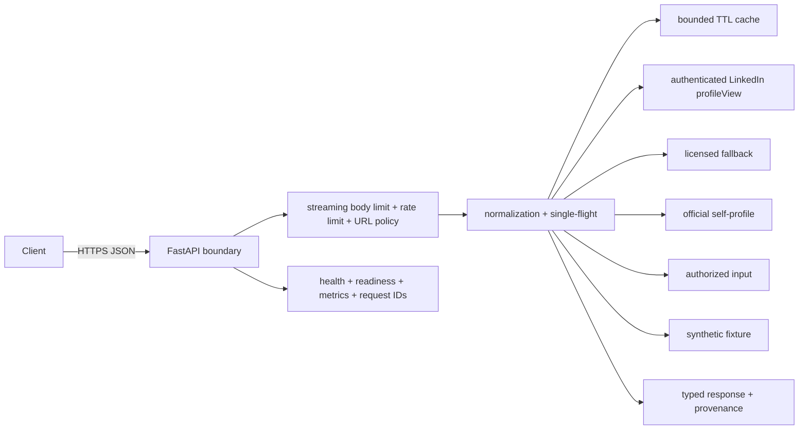

# ProfileProof

[](https://github.com/RitwijParmar/ProfileProof/actions/workflows/ci.yml)

ProfileProof turns a LinkedIn profile URL into stable, typed professional-profile
JSON. Its challenge-compliant path calls LinkedIn's authenticated Voyager
`profileView` surface, normalizes the returned entities, and reports provenance,
completeness, cache state, limitations, and a request ID. A licensed PDL provider
remains available as a separately labeled fallback.

## Try it

Open the landing page and enter a real profile, or call the API:

```bash
curl -sS https://profileproof-api-980932890834.us-east1.run.app/v1/profiles/resolve \
  -H 'Content-Type: application/json' \
  -d '{"profile_url":"https://www.linkedin.com/in/seanthorne"}'
```

Check `/v1/capabilities` first: `linkedin_session.configured: true` confirms that
the deployment has its authenticated session secrets. Interactive documentation is at `/docs`, ReDoc
at `/redoc`, and the machine-readable contract at `/openapi.json`.

## API

### `POST /v1/profiles/resolve`

```json
{
  "profile_url": "https://www.linkedin.com/in/seanthorne"
}
```

| Provider | Purpose | Upstream behavior |
|---|---|---|
| `linkedin_session` (default) | Retrieve most fields visible on a LinkedIn profile page | Authenticated fixed Voyager `profileView` endpoint; session secrets required |
| `people_data_labs` | Real professional-profile enrichment by LinkedIn URL | Fixed PDL endpoint; API key required; no user cookies |
| `linkedin_oidc` | Authenticated member's official lite profile | Fixed LinkedIn `/v2/userinfo` endpoint; bearer token required |
| `consented` | Normalize owner- or caller-supplied data | No upstream call and no persistence |
| `demo` | Deterministic integration fixture | No upstream call; synthetic and visibly labeled |

The schema covers name, headline, location, about, experience, education, skills,
certifications, languages, and images. Missing data is absent or an empty list; it
is never invented. Licensed responses include `licensed`, `match_confidence`, and
`dataset_version` alongside provider-specific limitations.

Errors use `application/problem+json` with `type`, `title`, `status`, `detail`,
`instance`, and `request_id`.

## Architecture



Identical concurrent cache misses share one upstream operation, preventing a
request burst from multiplying billable lookups. Acquisition is isolated behind
a provider interface, so the response contract is independent of the data source.

## Local development

Requirements: Python 3.12+ and [uv](https://docs.astral.sh/uv/).

```bash
uv sync --all-groups --locked
make check
make run
```

Then open <http://localhost:8080>. For the challenge path, set
`PROFILEPROOF_LINKEDIN_LI_AT` and `PROFILEPROOF_LINKEDIN_JSESSIONID` through a
local secret source; never commit them. See
`.env.example` for confidence, quota, timeout, cache, and rate-limit controls.

```bash
docker build -t profileproof:local .
docker run --rm -p 8080:8080 profileproof:local
```

## Security and privacy

- accepts only canonical `https://(www.)linkedin.com/in/<identifier>` URLs;
- derives only a URL-encoded public identifier from the caller URL;
- calls only fixed, TLS-only provider endpoints with redirects disabled;
- requests only professional fields and excludes emails, phone numbers, street
  addresses, social handles, and other contact data;
- rejects low-confidence or mismatched identities instead of returning a guess;
- bounds streamed request bodies, cache entries, rate-limit identities, provider
  calls, model collections, and Cloud Run scaling;
- keeps session cookies and provider keys in Secret Manager and never returns them;
- stores no profiles in a database; the one-hour in-memory cache is ephemeral;
- returns mandatory provenance and warnings so licensed, official, consented, and
  synthetic data cannot be silently confused.

The in-memory controls are per instance. Production therefore uses one bounded
Cloud Run instance for predictable provider-credit exposure. A larger deployment
should move quota and cache coordination to shared infrastructure and put API
Gateway or Cloud Armor in front. See [the threat model](docs/threat-model.md).

## Challenge approach

Official self-service OIDC exposes only the authenticated member's lite profile,
which cannot satisfy the requested experience, education, skills, certifications,
languages, and image fields. The default provider therefore reproduces the
authenticated profile-page request to LinkedIn's normalized Voyager response and
maps the returned entity types into the public schema. Session values are runtime
secrets, never source-controlled, logged, or returned.

Primary references:

- [LinkedIn API access](https://learn.microsoft.com/en-us/linkedin/shared/authentication/getting-access)
- [LinkedIn Profile API](https://learn.microsoft.com/en-us/linkedin/shared/integrations/people/profile-api)
- [LinkedIn User Agreement](https://www.linkedin.com/legal/user-agreement)
- [LinkedIn robots policy](https://www.linkedin.com/robots.txt)
- [PDL Person Enrichment API](https://docs.peopledatalabs.com/docs/person-enrichment-api)
- [PDL match confidence](https://docs.peopledatalabs.com/docs/output-response-person-enrichment-api)
- [OWASP SSRF prevention](https://cheatsheetseries.owasp.org/cheatsheets/Server_Side_Request_Forgery_Prevention_Cheat_Sheet.html)

## Limitations

- The default provider depends on an undocumented LinkedIn response and can break
  when LinkedIn changes it or expires/challenges the configured session.
- Data visibility is limited to fields visible to the configured account.
- Operators must ensure their use complies with applicable platform terms.
- PDL completeness and freshness depend on its dataset and subscription.
- Certifications and some other fields can require higher PDL field bundles.
- LinkedIn OIDC is a self-profile path and does not provide full career history.
- PDL does not supply a dependable profile-image field in this integration.
- The demo remains synthetic by design; it is a test fixture, not the main product.
- Cloud Run may cold-start when scaling from zero.

Deployment, verification, and rollback are documented in
[docs/deployment.md](docs/deployment.md).

**Live deployment:** <https://profileproof-api-980932890834.us-east1.run.app>

MIT licensed.
