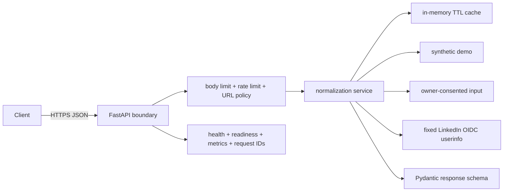

# ProfileProof

[](https://github.com/RitwijParmar/ProfileProof/actions/workflows/ci.yml)

ProfileProof is a production-grade API for normalizing professional profile data
into stable, typed JSON. It accepts a LinkedIn profile URL, canonicalizes it,
selects an explicit data provider, and returns profile fields with provenance,
completeness, limitations, warnings, caching state, and a request ID.

The public deployment is intentionally **consent-first**. It does not copy
browser cookies, submit LinkedIn credentials, call undocumented Voyager
endpoints, bypass access controls, or pretend synthetic data came from a real
member. This is a deliberate engineering decision, not an omitted secret.

## Try it

Open the landing page and press **Run live request**, or call the API:

```bash
curl -sS https://profileproof-api-980932890834.us-east1.run.app/v1/profiles/resolve \
  -H 'Content-Type: application/json' \
  -d '{"profile_url":"https://www.linkedin.com/in/profileproof-demo","provider":"demo"}'
```

Interactive documentation is available at `/docs`; ReDoc is at `/redoc`, and
the machine-readable contract is at `/openapi.json`.

## API

### `POST /v1/profiles/resolve`

```json
{
  "profile_url": "https://www.linkedin.com/in/profileproof-demo",
  "provider": "demo"
}
```

Providers:

| Provider | Purpose | Network behavior |
|---|---|---|
| `demo` | End-to-end public demonstration | No upstream call; accepts only `profileproof-demo` |
| `consented` | Normalize data supplied by its owner or authorized caller | No upstream call and no persistence |
| `linkedin_oidc` | Retrieve the authenticated member's official lite profile | Calls only LinkedIn's fixed `/v2/userinfo` endpoint |

The response schema includes the requested fields when the selected provider can
lawfully supply them: name, headline, location, about, experience, education,
skills, certifications, languages, and profile images. Missing information is
represented by absent nullable fields or empty lists, never invented values.

Representative response metadata:

```json
{
  "source": {
    "provider": "demo",
    "mode": "synthetic_demo",
    "consented": true,
    "limitations": ["This record is synthetic and is not associated with a real LinkedIn member."]
  },
  "meta": {
    "request_id": "b9cdbf0a-15a3-4d25-beca-ef18a376cc6b",
    "cached": false,
    "completeness": 0.9,
    "fields_present": ["name", "headline", "location", "about", "experience"],
    "warnings": ["demo_data"]
  }
}
```

Errors use `application/problem+json` and contain `type`, `title`, `status`,
`detail`, `instance`, and `request_id`.

## Architecture



The provider interface isolates acquisition from normalization. A production
organization with approved LinkedIn partner access can add a provider without
changing the public response contract or weakening URL validation.

## Local development

Requirements: Python 3.12+ and [uv](https://docs.astral.sh/uv/).

```bash
uv sync --all-groups --locked
make check
make run
```

Then open <http://localhost:8080>. To build the production container:

```bash
docker build -t profileproof:local .
docker run --rm -p 8080:8080 profileproof:local
```

Configuration uses `PROFILEPROOF_` environment variables; see `.env.example`.
If API-key protection is required, configure only the SHA-256 digest through
`PROFILEPROOF_API_KEY_SHA256`. Store production values in Secret Manager rather
than source control.

## Security and operations

- accepts only canonical `https://(www.)linkedin.com/in/<identifier>` URLs;
- rejects credentials, alternate ports, non-profile paths, and other hosts;
- never fetches the user-supplied URL, eliminating the primary SSRF path;
- the only outbound implementation uses a compile-time fixed LinkedIn OIDC URL
  and disables redirects;
- request bodies are bounded and Pydantic models forbid unknown fields;
- optional API-key comparison is constant-time and stores only a digest;
- rate limiting, bounded cache size, request IDs, structured logs, health,
  readiness, Prometheus text metrics, and security headers are included;
- the container runs as UID 10001 with no cloud permissions or writable project
  source, and Cloud Run terminates HTTPS.

The in-memory rate limit and cache are intentionally per-instance. At higher
scale, place Cloud Armor/API Gateway in front and use Memorystore or another
shared store. See [the threat model](docs/threat-model.md).

## Research and platform decision

Research used first-party or authoritative sources:

- LinkedIn documents that API access requires OAuth and that most permissions
  require explicit approval. Self-service OIDC returns the authenticated
  member's lite profile only: [API access](https://learn.microsoft.com/en-us/linkedin/shared/authentication/getting-access),
  [OIDC userinfo](https://learn.microsoft.com/en-us/linkedin/consumer/integrations/self-serve/sign-in-with-linkedin-v2).
- LinkedIn's current User Agreement prohibits scripts or robots that scrape or
  copy profiles, copied credentials/cookies, and bypassed access controls:
  [User Agreement section 8.2](https://www.linkedin.com/legal/user-agreement).
- OWASP recommends allowlisting known destinations, disabling redirects, and
  protecting cloud metadata from SSRF:
  [SSRF Prevention Cheat Sheet](https://cheatsheetseries.owasp.org/cheatsheets/Server_Side_Request_Forgery_Prevention_Cheat_Sheet.html).
- Cloud Run provides HTTPS at the stable `run.app` endpoint and recommends
  least-privilege service identities and Secret Manager:
  [security overview](https://cloud.google.com/run/docs/securing/security),
  [secret configuration](https://cloud.google.com/run/docs/configuring/services/secrets).

The hiring prompt permits using personal LinkedIn credentials, but the
production design declines that option. Passwords and session cookies are not a
reasonable backend integration contract. The official OIDC seam demonstrates
the authorized path; arbitrary matched-profile access should be added only with
LinkedIn partner approval or a data source whose license and subject consent are
documented.

## Known limitations

- The public service does not retrieve arbitrary real LinkedIn profiles.
- LinkedIn OIDC supplies a lite self-profile, not experience, education, skills,
  certifications, or languages.
- The demo profile is synthetic and images are intentionally omitted.
- Data supplied to `consented` is normalized but not independently verified.
- There is no database by design; responses and tokens are not persisted.
- Cloud Run instances may cold-start after scaling to zero.

## Deployment

The tested Cloud Run procedure, least-privilege service identity, verification
commands, and rollback steps are documented in [docs/deployment.md](docs/deployment.md).

**Live deployment:** <https://profileproof-api-980932890834.us-east1.run.app>

MIT licensed.
